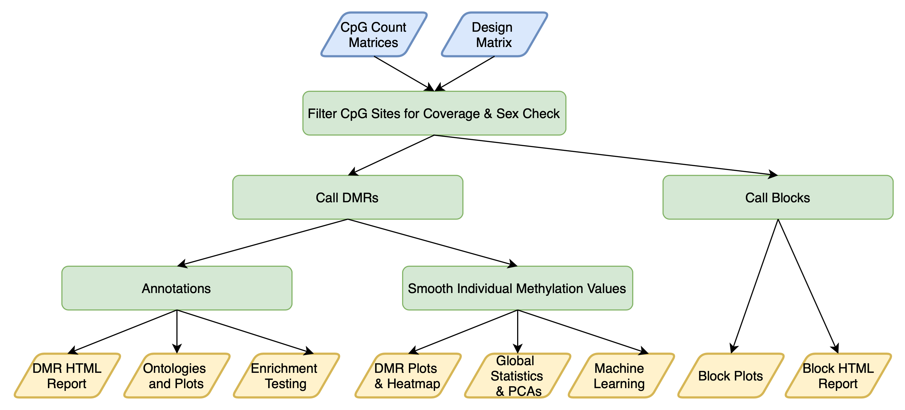
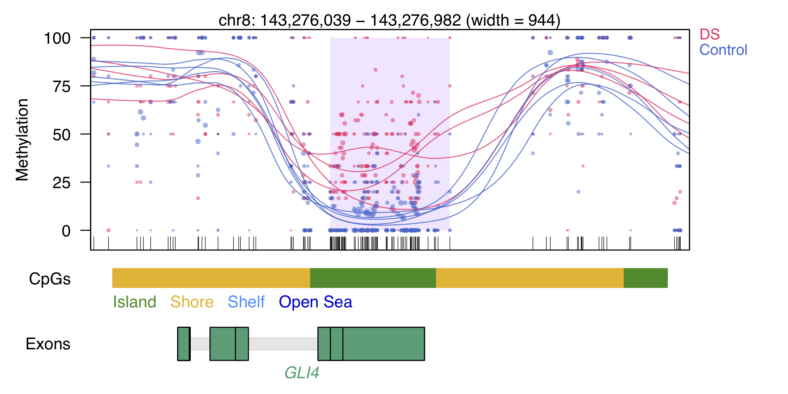

# DMRichR
#### A workflow for the statistical analysis and visualization of differentially methylated regions (DMRs) of CpG count matrices (Bismark cytosine reports) from the [CpG_Me pipeline](https://github.com/ben-laufer/CpG_Me).

### Table of Contents
0. [Overview](https://github.com/ben-laufer/DMRichR#overview)
1. [DMR Approach and Interpretation](https://github.com/ben-laufer/DMRichR#dmr-approach-and-interpretation)
2. [Installation](https://github.com/ben-laufer/DMRichR#installation)
3. [The Design Matrix and Covariates](https://github.com/ben-laufer/DMRichR#the-design-matrix-and-covariates)
4. [Input](https://github.com/ben-laufer/DMRichR#input)
   1. [Generic Example](https://github.com/ben-laufer/DMRichR#generic-example)
   2. [UC Davis Example](https://github.com/ben-laufer/DMRichR#uc-davis-example)
5. [Workflow and Output](https://github.com/ben-laufer/DMRichR#workflow-and-output)
   1. [Process Cytosine Reports](https://github.com/ben-laufer/DMRichR#1-process-cytosine-reports)
   2. [Genome-wide Background](https://github.com/ben-laufer/DMRichR#2-genome-wide-background)
   3. [Blocks](https://github.com/ben-laufer/DMRichR#3-blocks)
   4. [DMRs](https://github.com/ben-laufer/DMRichR#4-dmrs)
   5. [Smoothed Individual Methylation Values](https://github.com/ben-laufer/DMRichR#5-smoothed-individual-methylation-values)
   6. [ChromHMM and Roadmap Epigenomics Enrichments](https://github.com/ben-laufer/DMRichR#6-chromHMM-and-roadmap-epigenomics-enrichments)
   7. [Global Methylation Analyses](https://github.com/ben-laufer/DMRichR#7-global-methylation-analyses)
   8. [DMR Heatmap](https://github.com/ben-laufer/DMRichR#8-dmr-heatmap)
   9. [DMR Annotations](https://github.com/ben-laufer/DMRichR#9-dmr-annotations-and-dmrichments)
   10. [Manhattan and Q-Q plots](https://github.com/ben-laufer/DMRichR#10-manhattan-and-Q-Q-plots)
   11. [Gene Ontology Enrichments](https://github.com/ben-laufer/DMRichR#11-gene-ontology-enrichments)
   12. [Machine Learning](https://github.com/ben-laufer/DMRichR#12-machine-learning)
   13. [Cell Composition Estimation](https://github.com/ben-laufer/DMRichR#13-cell-composition-estimation)
   14. [RData](https://github.com/ben-laufer/DMRichR#14-RData)
6. [Citation](https://github.com/ben-laufer/DMRichR#citation)
7. [Publications](https://github.com/ben-laufer/DMRichR#publications)
8. [Acknowledgements](https://github.com/ben-laufer/DMRichR#acknowledgements)

## Overview

The goal of `DMRichR` is to make the comprehensive statistical analysis of whole genome bisulfite sequencing (WGBS) data accessible to the larger epigenomics community, so that it no longer remains a niche methodology. Whether it be peripheral samples from a large-scale human epidemiological study or a select set of precious samples from model and non-model organisms, WGBS can provide novel insight into the epigenome and its role in the regulation of gene expression. Furthermore, the functions and workflow are written with the goal of bridging the gap for those transitioning from Illumina's Infinium assay technology (450K and EPIC arrays) by providing statistical analysis and visualization functions that present the data in a familiar format. 

The overarching theme of `DMRichR` is the synthesis of popular [Bioconductor](https://bioconductor.org) R packages for the analysis of genomic data with the [tidyverse](https://www.tidyverse.org) philosophy of R programming. This allows for a streamlined and tidy approach for downstream data analysis and visualization. In addition to functioning as an R package, the central component of DMRichR is an [executable script](exec/DM.R) that is meant to be run as a single call from command line. While this is a non-traditional approach for R programming, it serves as a novel piece of software that simplifies the analysis process while also providing a backbone to build custom workflows on (in a manner similar to a traditional vignette).

`DMRichR` leverages the statistical algorithms from two popular R packages,`dmrseq` and `bsseq`, which enable the inference of differentially methylated regions (DMRs) from low-pass WGBS. In these smoothing based approaches, CpG sites with higher coverage are given a higher weight and used to infer the methylation level of neighboring CpGs with lower coverage. This approach favors a larger sample size over a deeper sequencing depth, and only requires between 1-5x coverage for each sample. By focusing on the differences in methylation levels between groups, rather than the absolute levels within a group, the methodologies utilized allow for a low-pass WGBS approach that assays ~10x more of the genome for only around ~2x the price of competing reduced representation methods (i.e. arrays and RRBS). In our experience, it is these unexplored regions of the genome that contain the most informative results for studies outside of the cancer research domain; however, these regions should also provide novel insight for cancer researchers as well. In order to facilitate an understanding of these DMRs and global methylation levels, `DMRichR` also works as a traditional R package with a number of downstream functions for statistical analysis and data visualization that can be viewed in the [R folder](R/). 

A single command line call performs the following steps:


## DMR Approach and Interpretation

The main statistical approach applied by the [executable script](exec/DM.R) located in the `exec` folder is `dmrseq::dmrseq()`, which identifies DMRs in a two step approach:
 
1. DMR Detection: The differences in CpG methylation for the effect of interest are pooled and smoothed to give CpG sites with higher coverage a higher weight, and candidate DMRs with a difference between groups are assembled.
2. Statistical Analysis: A region statistic for each DMR, which is comparable across the genome, is estimated via the application of a generalized least squares (GLS) regression model with a nested autoregressive correlated error structure for the effect of interest. Then, permutation testing of a pooled null distribution enables the identification of significant DMRs. This approach accounts for both inter-individual and inter-CpG variability across the entire genome.
 
The main estimate of a difference in methylation between groups is not a fold change but rather a beta coefficient, which is representative of the average [effect size](https://www.leeds.ac.uk/educol/documents/00002182.htm); however, it is on the scale of the [arcsine transformed differences](https://www.ncbi.nlm.nih.gov/pubmed/29481604) and must be divided by π (3.14) to be similar to the mean methylation difference over a DMR, which is provided in the `percentDifference` column. Since the testing is permutation based, it provides empirical p-values as well as FDR corrected q-values.

One of the key differences between `dmrseq` and other DMR identification packages, like `bsseq`, is that `dmrseq` is performing statistical testing on the DMRs themselves rather than testing for differences in single CpGs that are then assembled into DMRs like `bsseq::dmrFinder()` does. This unique approach helps with controlling the false discovery rate and testing the correlated nature of CpG sites in a regulatory region, while also enabling complex experimental designs. However, since `dmrseq::dmrseq()` does not provide individual smoothed methylation values, `bsseq::BSmooth()` is utilized to generate individual smoothed methylation values from the DMRs. Therefore, while the DMRs themselves are adjusted for covariates, the individual smoothed methylation values for these DMRs are not adjusted for covariates.

You can also read my general summary of the drmseq approach on [EpiGenie](https://epigenie.com/dmrseq-powers-whole-genome-bisulfite-sequencing-analysis/).

**Example DMR**

Each dot represents the methylation level of an individual CpG in a single sample, where the size of the dot is representative of coverage. The lines represent smoothed methylation levels for each sample, either control (blue) or DS (red). Gene and CpG annotations are shown below the plot.

## Installation

No manual installation of R packages is required, since the required packages and updates will occur automatically upon running the [executable script](exec/DM.R) located in the `exec` folder. However, the package does require Bioconductor and remotes, which you can install using:

```
if{(!requireNamespace(c("BiocManager", "remotes"), quietly = TRUE))
  install.packages(c("BiocManager", "remotes"), repos = "https://cloud.r-project.org")
}
```

Additionally, if you are interested in creating your own workflow as opposed to using the executable script, you can download the package using:

```
Sys.setenv("R_REMOTES_NO_ERRORS_FROM_WARNINGS" = TRUE)
BiocManager::install("ben-laufer/DMRichR")
```

Finally, while DMRichR works with R 4.0 it runs best with R 3.6.

## The Design Matrix and Covariates

This script requires a basic design matrix to identify the groups and covariates, which should be named `sample_info.xlsx` and contain header columns to identify the covariates. The first column of this file should be the sample names and have a header labelled as `Name`. In terms of the testCovariate label (i.e. Group or Diagnosis), it is important to have the label for the experimental samples start with a letter in the alphabet that comes after the one used for control samples in order to obtain results for experimental vs. control rather than control vs. experimental. You can select which specific samples to analyze from the working directory through the design matrix, where pattern matching of the sample name will only select bismark cytosine report files with a matching name before the first underscore, which also means that sample names should not contain underscores. Within the script, covariates can be selected for adjustment. There are two different ways to adjust for covariates: directly adjust values or balance permutations. Overall, DMRichR supports pairwise comparisons with a minimum of 4 samples (2 per a group). For each discrete covariate, you should also aim to have two samples per each grouping level.


 Name          | Diagnosis      | Age           |  Sex          |
| ------------- | -------------- | ------------- | ------------- |
| SRR3537014    | Idiopathic_ASD | 14            | M             |
| SRR3536981    | Control        | 42            | F             |


## Input

DMRichR utilizes [Bismark cytosine reports](https://github.com/FelixKrueger/Bismark/tree/master/Docs#optional-genome-wide-cytosine-report-output), which are genome-wide CpG methylation count matrices that contain all the CpGs in your genome of interest, including CpGs that were not covered in the experiment. The genome-wide cytosine reports contain important information for merging the top and bottom strand of symmetric CpG sites, which is not present in Bismark `coverage` and `bedGraph` files. In general, cytosine reports have the following pattern: `*_bismark_bt2_pe.deduplicated.bismark.cov.gz.CpG_report.txt.gz`. [CpG_Me](https://github.com/ben-laufer/CpG_Me) will generate a folder called `cytosine_reports` after calling the final QC script (please don't use the `cytosine_reports_merged` folder for DMRichR). If you didn't use CpG_Me, then you can use the `coverage2cytosine` module in `Bismark` to generate the cytosine reports. The cytosine reports have the following format:

|chromosome|position|strand|count methylated|count non-methylated|C-context|trinucleotide context|
|----------|--------|------|----------------|--------------------|---------|---------------------|
chr2	     |10470   |	+	|1	              |0                   |CG	      |CGA                  |
chr2	     |10471   |	-	|0	              |0                   |CG	      |CGG                  |
chr2	     |10477   |	+	|0	              |1                   |CG	      |CGA                  |
chr2	     |10478   |	-	|0	              |0                   |CG	      |CGG                  |

Before running the executable, ensure you have the following project directory tree structure for the cytosine reports and design matrix:

```
├── Project
│   ├── cytosine_reports
│   │   ├── sample1_bismark_bt2.deduplicated.bismark.cov.gz.CpG_report.txt.gz
│   │   ├── sample2_bismark_bt2.deduplicated.bismark.cov.gz.CpG_report.txt.gz
│   │   ├── sample_info.xlsx
```

This workflow requires the following variables:
1. `-g --genome` Select either: hg38, hg19, mm10, mm9, rheMac10, rheMac8, rn6, danRer11, galGal6, bosTau9, panTro6, dm6, canFam3, susScr11, TAIR10, or TAIR9. It is also possible to add other genomes with `BSgenome`, `TxDb`, and `org.db` databases by modifying `DMRichR::annotationDatabases()`.
2. `-x --coverage` CpG coverage cutoff for all samples, 1x is the default and minimum value.
3. `-s --perGroup` Percent of samples per a group for CpG coverage cutoff, values range from 0 to 1. 1 (100%) is the default. 0.75 (75%) is recommended if you're getting less than 15 million CpGs assayed when this is set to 1.
4. `-m --minCpGs` Minimum number of CpGs for a DMR, 5 is default.
5. `-p --maxPerms` Number of permutations for the DMR analysis, 10 is default. The total number of permutations should not exceed the number of samples. 
6. `-b --maxBlockPerms` Number of permutations for the block analysis, 10 is default. The total number of permutations should not exceed the number of samples. 
7. `-o --cutoff` The cutoff value for the single CpG coefficient utilized to discover testable background regions, values range from 0 to 1, 0.05 (5%) is the default. If you get more than 5,000 DMRs you should try 0.1 (10%).
8. `-t --testCovariate` Covariate to test for significant differences between experimental and control (i.e. Diagnosis).
9. `-a --adjustCovariate` Adjust covariates that are continuous (i.e. Age) or discrete with two or more factor groups (i.e. Sex). More than one covariate can be adjusted for using single brackets and the `;` delimiter, i.e. `'Sex;Age'`
10. `-m --matchCovariate` Covariate to balance permutations, which is meant for two-group factor covariates in small sample sizes in order to prevent extremely unbalanced permutations. Only one two-group factor can be balanced (i.e. Sex). Note: This will not work for larger sample sizes (> 500,000 permutations) and is not needed for them as the odds of sampling an extremely unbalanced permutation for a covariate decreases with increasing sample size. Futhermore, we generally do not use this in our analyses, since we prefer to directly adjust for sex.
11. `-c --cores` The number of cores to use, 20 is recommended but you can go as low as 3, 20 is the default and it requires between 32 to 256 GB of RAM, where the RAM depends on number of samples and coverage.
12. `-k --sexCheck` A logical (TRUE or FALSE) indicating whether to run an analysis to confirm the sex listed in the design matrix based on the ratio of the coverage for the Y and X chromosomes. The sex chromosomes will also be removed from downstream analyses if both sexes are detected. This argument assumes there is a column in the design matrix named "Sex" [case sensitive] with Males coded as either "Male", "male", "M", or "m" and Females coded as "Female", "female", "F", or "f". 
13. `-d --ensembl` A logical (TRUE or FALSE) indicating whether to use Ensembl transcript annotations instead of the default Biocondcutor annotations, which are typically from UCSC. These annotations may allow DMRs for non-model organism genomes (i.e. rheMac10) to be mapped to substantially more genes, which will improve DMReport and gene ontology results. 
14. `-f --GOfuncR` A logical (TRUE or FALSE) indicating whether to run a GOfuncR gene ontology analysis. This is our preferred GO method; however, it is time consuming when there is a large number of DMRs.  
15. `-e --cellComposition` A logical (TRUE or FALSE) indicating whether to run an analysis to estimate cell composition in adult whole blood samples. The analysis will only run for hg38 and hg19. This is an **experimental feature** and requires follow up comparisons with similar array-based papers to confirm accuracy. Use at your own risk. 

#### Generic Example

Below is an example of how to execute the [main R script (DM.R)](exec/DM.R) in the `exec` folder on command line. This should be called from the working directory that contains the cytosine reports. You will have to modify the path to the DM.R script in the call. 

```
call="Rscript \
--vanilla \
/path/to/scripts/DM.R \
--genome hg38 \
--coverage 1 \
--perGroup '0.75' \
--minCpGs 5 \
--maxPerms 10 \
--maxBlockPerms 10 \
--cutoff '0.05' \
--testCovariate Diagnosis \
--adjustCovariate 'Sex;Age' \
--sexCheck TRUE \
--ensembl FALSE \
--cores 20"

echo $call
eval $call
```

#### UC Davis Example

If you are using the Barbera cluster at UC Davis, the following commands can be used to execute `DM.R` from your login node (i.e. epigenerate), where `htop` should be called first to make sure the whole node is available. This should be called from the working directory that contains the cytosine reports and **not** from within a `screen`.

```
module load R/3.6.3

call="nohup \
Rscript \
--vanilla \
/share/lasallelab/programs/DMRichR/DM.R \
--genome hg38 \
--coverage 1 \
--perGroup '0.75' \
--minCpGs 5 \
--maxPerms 10 \
--maxBlockPerms 10 \
--cutoff '0.05' \
--testCovariate Diagnosis \
--adjustCovariate 'Sex;Age' \
--sexCheck TRUE \
--cores 20 \
--ensembl FALSE \
> DMRichR.log 2>&1 &"

echo $call
eval $call 
echo $! > save_pid.txt
```

You can then check on the job using `tail -f DMRichR.log` and <kbd>⌃ Control</kbd> + <kbd>c</kbd> to exit the log view. 
You can cancel the job from the project directory using `cat save_pid.txt | xargs kill`. You can also check your running jobs using `ps -ef | grep `, which should be followed by your username i.e. `ps -ef | grep blaufer`. Finally, if you still see leftover processes in htop, you can cancel all your processes using `pkill -u`, which should be followed by your username i.e. `pkill -u blaufer`.

Alternatively, the executable can also be submitted to the cluster using the [shell script](exec/DM.R.sh) via `sbatch DM.R.sh`.

## Workflow and Output

This workflow carries out the following steps:

#### 1) Process Cytosine Reports

`DMRichR::processBismark()` will load the genome-wide cytosine reports, assign the metadata from the design matrix, and filter the CpGs for equal coverage between the testCovariate as well as any discrete adjustCovariates. There is also an option to confirm the sex of each sample. The end result of this function is a class `bsseq` object (`bs.filtered`) that contains the methylated and total count data for each CpG.

#### 2) Genome-wide Background

`DMRichR::getBackground()` will generate a csv file with the genome-wide background that is termed the bsseq background. The DM.R workflow uses the dmrseq defined background regions; however, the bsseq background is also provided. The dmrseq and bsseq regions offer very different perspectives, since the dmrseq background regions are defined as the testable regions that show a difference between groups and the DMRs overlap precisely with these background regions, which is ideal for many types of enrichment testing. The bsseq background regions are more representative of genome-wide CpG coverage; however, their size is highly variable and they do not overlap precisely with the DMRs. Therefore, each approach has its own strengths and weaknesses. 

#### 3) Blocks

The `bsseq` object is used to identify large blocks (> 5 kb in size) of differential methylation via `dmrseq::dmrseq()` by using a different smoothing approach than the DMR calling, which "zooms out". It will increase the minimum CpG cutoff by 2x when compared to the DMR calling. In addition to bed files and excel spreadsheets with the significant blocks (`sigBlocks`) and background blocks (`blocks`), plots of the blocks will be generated by `dmrseq::plotDMRs()` and an html report with gene annotations are also generated through `DMRichR::annotateRegions()` and `DMRichR::DMReport()`.

#### 4) DMRs

The `bsseq` object is used to call DMRs through `dmrseq::dmrseq()`. The DMRs typically range in size from a several hundred bp to a few kb. In addition to bed files and excel spreadsheets with the significant DMRs (`sigRegions`) and background regions (`regions`), plots of the DMRs will be generated by `DMRichR::plotDMRs2()` and an html report with gene annotations are also generated through `DMRichR::annotateRegions()` and `DMRichR::DMReport()`.

#### 5) Smoothed Individual Methylation Values

Since `dmrseq::dmrseq()` smooths the differences between groups, it isn't possible to get individual smoothed methylation values for downstream analyses and visualization. Therefore, the `bsseq` object is smoothed using `bsseq::BSmooth()` to create a new `bsseq` object (`bs.filtered.bsseq`) with individual smoothed methylation values.

#### 6) ChromHMM and Roadmap Epigenomics Enrichments

Enrichment testing from the [chromHMM](https://dx.doi.org/10.1038/nmeth.1906) core 15-state chromatin state model and the related 5 core histone modifications from [Roadmap epigenomics](https://dx.doi.org/10.1038/nature14248) 127 reference epigenomes is performed using the [LOLA package](https://bioconductor.org/packages/release/bioc/html/LOLA.html) through the `DMRichR::chromHMM()` and `DMRichR::roadmap()` functions. The results are also plotted on a heatmap by `DMRichR::chromHMM_heatmap()` and `DMRichR::roadmap_heatmap()`. This is currently restricted to the UC Davis cluster due to requiring large external databases; however, an advanced user can [download the databases](http://databio.org/regiondb) and modify the functions to refer to their local copy.

#### 7) Global Methylation Analyses

`DMRichR::globalStats()` uses the smoothed `bsseq` object to test for differences in global and chromosomal methylation with the same adjustments as the DMR calling, where it generates an excel spreadsheet with the results and input. CpG island statistics are also generated for human, mouse, and rat (hg38, hg19, mm10, mm9, and rn6). `DMRichR::singleCpGPCA` generates a single CpG PCA plot, `DMRichR::windowsPCA()` generates a PCA plot of 20 kb windows, and `DMRichR::CGiPCA()` generates a PCA of CpG island methylation for human, mouse, and rat. The PCA plots are generated using [ggbiplot](https://github.com/vqv/ggbiplot) and the ellipses in the PCAs represent the 68% confidence interval, which is 1 standard deviation from the mean for a normal distribution. Finally, `DMRichR::densityPlot()` generates a density plot of the average single CpG methylation levels for the testCovariate. 

#### 8) DMR Heatmap

`DMRichR::smoothPheatmap()` generates a [heatmap](https://github.com/raivokolde/pheatmap) of the results with annotations for discrete covariates. The heatmap shows the hierarchal clustering of Z-scores for the non-adjusted percent smoothed individual methylation values for each DMR, where the Z-score corresponds to the number of standard deviations from the mean value of each DMR.

#### 9) DMR Annotations and DMRichments

`DMRichR::DMRichCpG()` and `DMRichR::DMRichGenic()` will obtain and perform enrichment testing for CpG and gene region (genic) annoations, respetively. The results are plotted using `DMRichR::DMRichPlot()` and `DMRichR::DMparseR()` enables plots with facets based on DMR directionality. The above approach for genic annoations is similair to what is typically peformed for arrays and other sequencing approaches, where certain terms are given priority over others if DMRs overlap with more than one. An alternate approach for enrichment testing of genic and CpG annotations can be done using the [CGi repository](https://github.com/ben-laufer/CGi), which tests each genic annotation seperately and corrects for GC content. The data needed for the alternative approach presented in CGi can be obtained using `DMRichR::annotateGenic()` and `DMRichR::annotateCpGs()`, which will retrieve gene region and CpG annotations for the DMRs and background regions for hg38, hg19, mm10, mm9, and rn6 using the [annotatr package](https://www.bioconductor.org/packages/release/bioc/html/annotatr.html).

#### 10) Manhattan and Q-Q plots

`DMRichR::manQQ()` will take the output of `DMRichR::annotateRegions()` and use it to generate Manhattan and Q-Q plots with the [CMplot package](https://github.com/YinLiLin/R-CMplot). 

#### 11) Gene Ontology Enrichments

Gene ontology enrichments are performed seperately for all DMRs, the hypermethylated DMRs and the hypomethylated DMRs. All results all saved as excel spreadsheets. There are three approaches used, which are based on R programs that interface with widely used tools:

##### A) `rGREAT` 

[rGREAT](https://www.bioconductor.org/packages/release/bioc/html/rGREAT.html) enables the [GREAT](http://great.stanford.edu/public/html/) approach, which works for hg38, hg19, mm10, and mm9. It performs testing based on genomic coordinates and relative to the background regions. It uses the default GREAT settings, where regions are mapped to genes if they are within a basal regulatory domain of 5 kb upstream and 1 kb downstream; however, it also extends to further distal regions and includes curated regulatory domains.

##### B) `GOfuncR`

[GOfuncR](https://www.bioconductor.org/packages/release/bioc/html/GOfuncR.html) enables the [FUNC](https://dx.doi.org/10.1186/1471-2105-8-41) approach, which works for all genomes and is our preferred method. It utilizes genomic coordinates and performs permutation based enrichment testing for the DMRs relative to the background regions. Regions are only mapped to genes if they are between 5 kb upstream and 1 downstream. 

##### C) `enrichR` 

[enrichR](https://cran.r-project.org/web/packages/enrichR/vignettes/enrichR.html) enables the [Enrichr](https://amp.pharm.mssm.edu/Enrichr/) approach, which is based on gene symbols and uses the closest gene to a DMR. It works for all mammalian genomes. While it doesn't utilize genomic coordinates or background regions, it offers a number of extra databases. 

##### REVIGO and Plots

Finally, `DMRichR::slimGO()` will take the significant results from of all tools, slim them using [rrvgo](https://bioconductor.org/packages/release/bioc/html/rrvgo.html), and then `DMRichR::GOplot()` will plot the top slimmed significant terms. This reduces the redundancy of closey related terms and allows for a more comprehensive overview of the top ontologies.

#### 12) Machine Learning 

`DMRichR::methylLearn()` utilizes random forest and support vector machine algorithms from [Boruta](https://cran.r-project.org/web/packages/Boruta/index.html) and [sigFeature](https://bioconductor.org/packages/release/bioc/html/sigFeature.html) in a feature selection approach to identify the most informative DMRs based on individual smoothed methylation values. It creates an excel spreadsheet and an html report of the results along with a heatmap. 

#### 13) Cell Composition Estimation

The epigenome is defined by its ability to create cell type specific differences. Therefore, when assaying heterogenous sample sources, it is standard for array-based methylation studies to estimate cell type composition and adjust for it in their model. While this is a standard for array-based studies, it is a significant challenge for WGBS studies due to differences in the nature of the data and the lack of appropriate reference sets and methods. In order to address this, we offer two approaches, both of which provide statistics and plots through `DMRichR::CCstats()` and `DMRichR::CCplot()`. However, it must be said that, unlike the rest of DMRichR, this is an **experimental feature** that you need to further investigate by comparing to array studies that are similar to yours.

##### A) The Houseman Method

The Houseman method is a standard for arrays and we have adapted it to work with WGBS data. The workflow will convert the smoothed `bsseq` object to a matrix of beta values for all EPIC array probes. It will then estimate cell composition using the IDOL reference CpGs in a modified Houseman method via `DMRichR::Houseman()`. If you use the results from this method you should also cite: [1](https://dx.doi.org/10.1186/s13059-018-1448-7), [2](https://dx.doi.org/10.1186/s12859-016-0943-7), [3](https://dx.doi.org/10.1093/bioinformatics/btu049), and [4](https://dx.doi.org/10.1186/1471-2105-13-86).

##### B) The methylCC Method

`methylCC` is designed to be technology independent by identifying DMRs that define cell types. The workflow uses `bumphunter()` to find cell type specific DMRs in an array reference database and then examines those regions within your dataset. In this case, it has been modified to utilize the `FlowSorted.Blood.EPIC` reference dataset and quantile normalization. If you use the results from this method you should also cite: [1](https://dx.doi.org/10.1186/s13059-019-1827-8) and [2](https://dx.doi.org/10.1186/s13059-018-1448-7).

#### 14) RData

The output from the main steps is saved in the RData folder so that it can be loaded for custom analyses or to resume an interrupted run:

`settings.RData` contains the parsed command line options given to DMRichR as well as the annotation database variables. These variables are needed for many of the DMRichR functions, and if you need to reload them, you should also run `DMRichR::annotationDatabases(genome)` after, since some of the annotation databases have temporary pointers. 

`bismark.RData` contains `bs.filtered`, which is a bsseq object that contains the filtered cytosine report data and the metadata from sample_info.xlsx in the `pData`.

`Blocks.RData` contains `blocks`, which is a GRanges object of the background blocks. This can be further filtered to produce the `sigBlocks` object if significant blocks are present. 

`DMRs.RData` contains `regions` and `sigRegions`, which are GRanges objects with the background regions and DMRs, respectively. 

`bsseq.RData` contains `bs.filtered.bsseq`, which is a bsseq object that has been smoothed by `bsseq::BSmooth()` and is used for the individual methylation values (but not the DMR or block calling by `dmrseq`, which uses a different smoothing approach).

`machineLearning.RData` contains `methylLearnOutput`, which is the output from the machine learning feature selection.

`cellComposition.RData` contains the output from the cell composition estimation analyses. `HousemanCC` is from the Houseman method, while `methylCC` and `ccDMRs` are from the methylCC method.

## Citation

If you use **DMRichR** in published research please cite the following 3 articles:

Laufer BI, Hwang H, Jianu JM, Mordaunt CE, Korf IF, Hertz-Picciotto I, LaSalle JM. Low-Pass Whole Genome Bisulfite Sequencing of Neonatal Dried Blood Spots Identifies a Role for RUNX1 in Down Syndrome DNA Methylation Profiles. *Human Molecular Genetics*, 2020. **doi**: [10.1093/hmg/ddaa218](https://doi.org/10.1093/hmg/ddaa218)

Korthauer K, Chakraborty S, Benjamini Y, and Irizarry RA. Detection and accurate false discovery rate control of differentially methylated regions from whole genome bisulfite sequencing. *Biostatistics*, 2018. **doi**: [10.1093/biostatistics/kxy007](https://doi.org/10.1093/biostatistics/kxy007)

Hansen KD, Langmead B, Irizarry RA. BSmooth: from whole genome bisulfite sequencing reads to differentially methylated regions. *Genome Biology*, 2012. **doi**: [10.1186/gb-2012-13-10-r83](https://doi.org/10.1186/gb-2012-13-10-r83)

## Publications

The following publications utilize **DMRichR**:

Laufer BI, Gomez JA, Jianu JM, LaSalle, JM.  Stable DNMT3L Overexpression in SH-SY5Y Neurons Recreates a Facet of the Genome-Wide Down Syndrome DNA Methylation Signature. *bioRxiv* preprint, 2020. **doi**:[10.1101/2020.11.09.374793](https://doi.org/10.1101/2020.11.09.374793)

Mordaunt CE, Jianu JM, Laufer BI, Zhu Y, Dunaway KW, Bakulski KM, Feinberg JI, Volk HE, Lyall K, Croen LA, Newschaffer CJ, Ozonoff S, Hertz-Picciotto I, Fallin DM, Schmidt RJ, LaSalle JM. Cord blood DNA methylome in newborns later diagnosed with autism spectrum disorder reflects early dysregulation of neurodevelopmental and X-linked genes. *Genome Medicine*, 2020. **doi**: [10.1186/s13073-020-00785-8](https://doi.org/10.1186/s13073-020-00785-8)

Laufer BI, Hwang H, Jianu JM, Mordaunt CE, Korf IF, Hertz-Picciotto I, LaSalle JM. Low-Pass Whole Genome Bisulfite Sequencing of Neonatal Dried Blood Spots Identifies a Role for RUNX1 in Down Syndrome DNA Methylation Profiles. *Human Molecular Genetics*, 2020. **doi**: [10.1093/hmg/ddaa218](https://doi.org/10.1093/hmg/ddaa218)

Murat El Houdigui S, Adam-Guillermin C, Armant O. Ionising Radiation Induces Promoter DNA Hypomethylation and Perturbs Transcriptional Activity of Genes Involved in Morphogenesis during Gastrulation in Zebrafish. *International Journal of Molecular Sciences*, 2020. **doi**: [10.3390/ijms21114014](https://doi.org/10.3390/ijms21114014)

Wöste M, Leitão E, Laurentino S, Horsthemke B, Rahmann S, Schröder C. wg-blimp: an end-to-end analysis pipeline for whole genome bisulfite sequencing data. *BMC Bioinformatics*, 2020. **doi**: [10.1186/s12859-020-3470-5](https://doi.org/10.1186/s12859-020-3470-5)

Lopez SJ, Laufer BI, Beitnere U, Berg E, Silverman JL, Segal DJ, LaSalle JM. Imprinting effects of UBE3A loss on synaptic gene networks and Wnt signaling pathways. *Human Molecular Genetics*, 2019. **doi**: [10.1093/hmg/ddz221](https://doi.org/10.1093/hmg/ddz221) 

Vogel Ciernia A*, Laufer BI*, Hwang H, Dunaway KW, Mordaunt CE, Coulson RL, Yasui DH, LaSalle JM. Epigenomic convergence of genetic and immune risk factors in autism brain. *Cerebral Cortex*, 2019. **doi**: [10.1093/cercor/bhz115](https://doi.org/10.1093/cercor/bhz115)

Laufer BI, Hwang H, Vogel Ciernia A, Mordaunt CE, LaSalle JM. Whole genome bisulfite sequencing of Down syndrome brain reveals regional DNA hypermethylation and novel disease insights. *Epigenetics*, 2019. **doi**: [10.1080/15592294.2019.1609867](https://doi.org/10.1080/15592294.2019.1609867)

## Acknowledgements

The development of this program was suppourted by a Canadian Institutes of Health Research (CIHR) postdoctoral fellowship [MFE-146824] and a [CIHR Banting postdoctoral fellowship](https://banting.fellowships-bourses.gc.ca/en/2018-2019-eng.html) [BPF-162684]. [Hyeyeon Hwang](https://github.com/hyeyeon-hwang) developed `methylLearn()` and the sex checker for `processBismark()`. [Charles Mordaunt](https://github.com/cemordaunt) developed `getBackground()` and `plotDMRs2()` as well as the CpG filtering approach in `processBismark()`. I would also like to thank [Keegan Korthauer](https://github.com/kdkorthauer), [Matt Settles](https://github.com/msettles), and [Ian Korf](https://github.com/KorfLab) for invaluable discussions related to the bioinformatic approaches utilized in this repository. 
